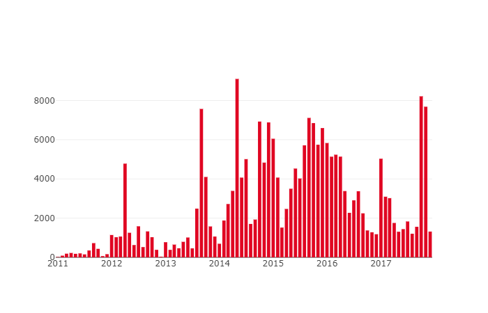

# Racist Comment Generator
A racist german chatbot trained on facebook comments.

The current prototype is trained on 380,000 facebook comments from german far right pages (mostly NPD related) on a small network for about 24h on my laptop.

It already produces quite funny sentences although it does many grammar mistakes and rarely the stuff it says makes sense (which is something it may have learned from the training data).

See this example conversation. All answers are generated by the chatbot!
```
> Guten Morgen!
Genau so ist es dann auch nicht das deutsche Kinder aufgezogen.
> Was denn für Kinder?
Wenn du willst du das auch deutsche Kinder haben würdest du das auch keine Ausländer die deutsche sind, auch unsere Aussagen die sie dieses Problem der Vergewaltigungen und ihre Schuld nicht wissen, wenn wir deutschen auch nicht mehr......
> Das macht keinen Sinn
Genau so ist es nicht verstanden!
> Und was denkst du von Merkel?
Du bist doch nicht besser...
> Alles klar, ciao!
Ich will die NPD wählen.
```

I am currently extending the data set to contain more than 1,000,000 comments and want to train a new model on a large network on a more powerful machine, stay tuned! I will publish the model once I'm done.

### The Crawler
Is idempotent and can be configured useing `config.yml`.
If you rerun it, it will only download the newest comments based on some heuristics.
One can also add new pages to the configuration at any time, the crawler will download the missing parts without creating any duplicates.

The crawler is fast, downloading up to 250,000 comments per hour.


### The data set
Will be analyzed in more detail soon.

The following chart shows the comments per month on the main NPD facebook page:

One can already spot many interesting peaks: The elections in late 2013 and 2017, the NPD entering the EU parliament in 2015 or the pronouncement of the proceedings to have the NPD banned in early 2017.


### The RNN
Is mostly based on [this amazing project](https://github.com/pender/chatbot-rnn). Everything is built on top of the [tensorflow port](https://github.com/sherjilozair/char-rnn-tensorflow) of Andrej Karpathy's [char-rnn](https://github.com/karpathy/char-rnn).

Result after training on a 256 unit, 3 layer RNN for 24h on a i7 Laptop CPU:


## Analysis
To futher clean the data my next steps will be a more detailed data analysis.
Besides obvious 'dirt' (like comments that only contain emojis or tagged friends) I am for example facing the issue that there a quite a lot of anti-fascist comments on far right facebook pages.
As I want the data set to be as racist as possible, I want to avoid training on anti-racist comments and would like to filter them out.

In the beginning my main idea was to cluster commenters in groups that like each other's posts and then classify the clusters in racist and anti-racist commenters based on their language. Unfortunately the entire cluster idea did not work out, because facebook does no longer return the real user ID's via the Graph API for privacy reasons. So building up a graph is not possible at all.

What I want to try next is to focus more on the language itself. Unfortunately there is no text corpus (like e.g. [WordNet](https://wordnet.princeton.edu/)) openly available for the german language.
This is key for analyzing which words are used often in a text compared to "normal" language.
I may try building up a corpus on my own by crawling all kinds of other facebook pages.

One final thought I have is to come up with a way to convert a facebook comment into a vector that indicates it's topic/intention/style, similar to what e.g. word2vec does with words. This way one can easily train a classifier to identify hate speech. First I need to get more into NLP though...


## How to build your own Chatbot based on Facebook comments
1. Create a database on a MySQL/MariaDB server and import `schema.sql`
2. Adapt `config.yml`
3. Run `crawl.py` to download the comments from the configured pages
4. Run `generate_dataset.py` to produce the data set used for training
5. Run `train.py` to train a new model
6. Run `chatbot.py` to test it out